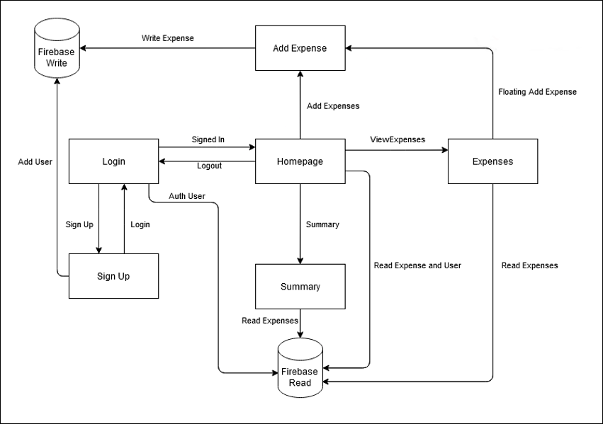
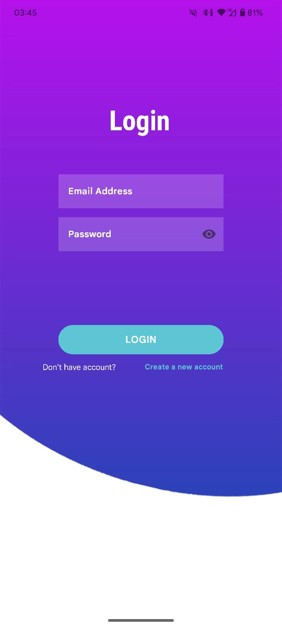
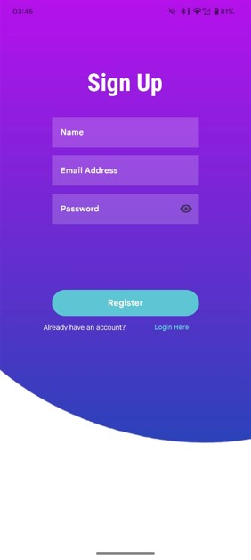
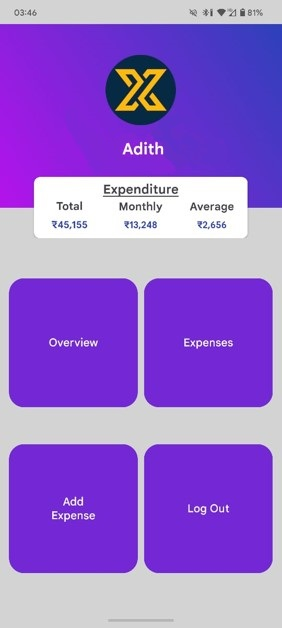
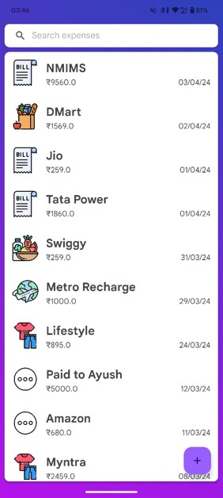
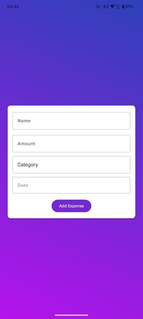
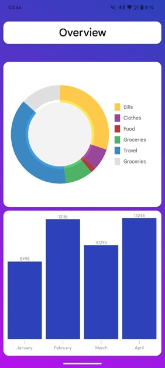

**Expense Tracker Android App**

## Overview

This Android application provides a user-friendly system to help you take control of your finances. Track daily expenses, gain insights into your spending habits, and make informed budgeting decisions.

## Key Features

* **Easy Expense Logging:** Quickly enter your expenses, categorizing them for clarity.
* **Visual Spending Overview:** Get clear charts and graphs to understand exactly where your money is going.
* **Secure Login and Signup:** Protect your financial data with robust authentication.
* **Intuitive Interface:** Navigate the app with ease, thanks to a well-designed and streamlined user interface.

## Screenshots

**Block Diagram**
* 

**Login & Signup**
*  |  

**Home Page**
* 

**Expense Management**
*  | 

**Spending Analysis**
*  

## Technical Details
* **Development Platform:** Android 
* **Languages:** Java
* **Database:** Firebase
* **UI Design:**  XML

## License
Copyright (C) Adith. See [LICENSE](/LICENSE) for more information.